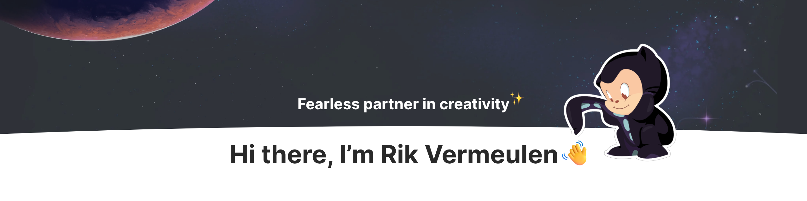

<picture>
  <source media="(prefers-color-scheme: dark)" srcset="./assets/dark.png">
  
</picture>

I am a Creative Developer living in Heukelum, the Netherlands. I develop full-scale creative digital experiences for some amazing agencies and hugely talented people around the world. I’m here to ask the necessary and sometimes difficult questions to create products and concepts that focus on and prioritise people.

#

  <a href="https://twitter.com/rikvermeulen_">Twitter</a> •
  <a href="https://www.rikvermeulen.com">Portfolio</a> •
  <a href="https://www.linkedin.com/in/rik-vermeulen/">Linkedin</a>
   

## My main projects

- ⚡ [lightning](https://github.com/rikvermeulen/lightning)
- 🧶 [create-lightning-app](https://github.com/rikvermeulen/create-lightning-app)
- 🦊 [co-op](https://github.com/rikvermeulen/co-op-gitlab)
- 👨🏻‍💻 [portfolio](https://github.com/)

## Tools

## Trivia

- 🌱 I’m currently learning **React, Node, NextJS, Svelte, kubernetes, docker**
- 👨‍💻 All of my projects are available at [rikvermeulen.com](https://www.rikvermeulen.com)
- 💬 Ask me about **Anything**
- 📫 How to reach me **rik.vermeulen.1997@live.nl**

    
**[Visit my website &rarr;](https://www.rikvermeulen.com)**
